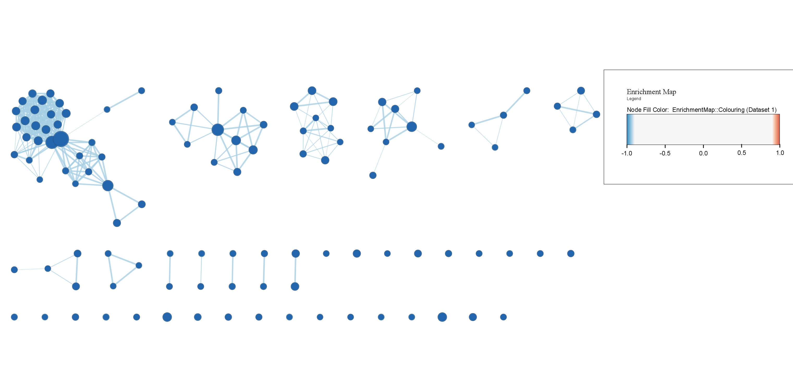
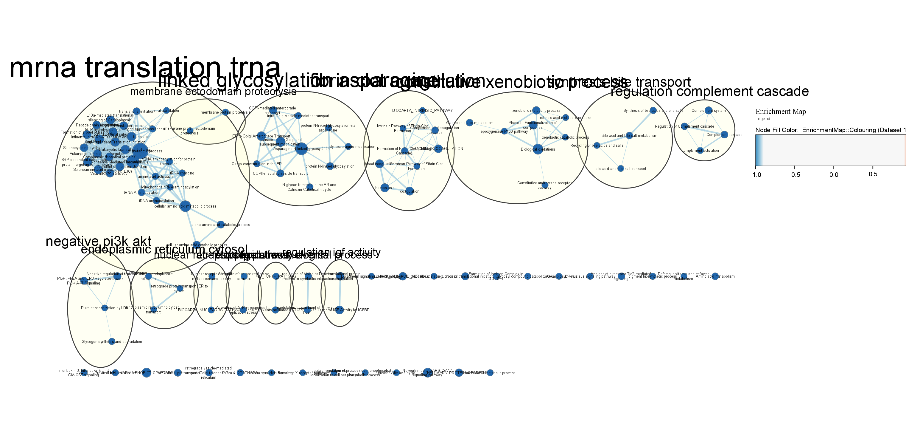
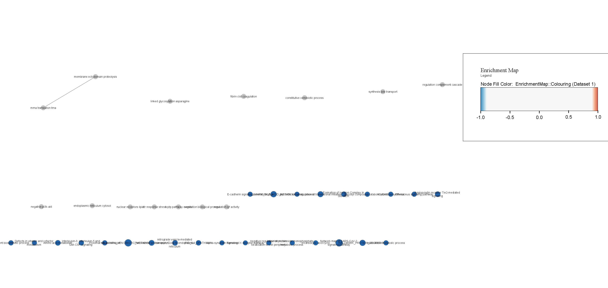
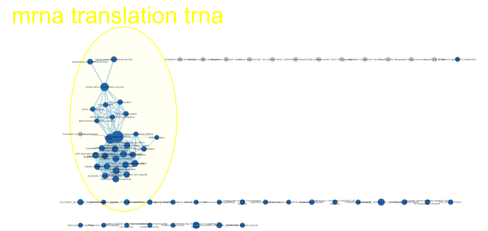

---
title: "BCB420H Assignment 2"
author: "Terrence Amponsah"
output:
  html_document:
    toc: true
student_no: 1005413429
bibliography: a2.bib
---

# 1. Intro:
## Setup: 
### R:
Installing the R packages used in this notebook.
```{r, message=FALSE}
if (!requireNamespace(c("BiocManager", "GEOmetadb", "knitr", "edgeR", "limma"), quietly = TRUE)){
  install.packages("BiocManager")
  install.packages("GEOmetadb")
  install.packages("knitr")
  install.packages("edgeR")
  install.packages("limma")
}


library(DBI)
library(GEOmetadb)
library(GEOquery)
library(edgeR)
BiocManager::install("biomaRt")
library(limma)

# A2 it seems.
library (ComplexHeatmap)
library(circlize)
```

###  Dataset & Normalization (From Assignment 1 & 2): 
INTRO ABOUT DATASET!!!!
For analysis, I chose the dataset [GSE126848](https://www.ncbi.nlm.nih.gov/geo/query/acc.cgi?acc=GSE126848)[@Suppli2019-hz]

### [Dataset](https://www.ncbi.nlm.nih.gov/geo/query/acc.cgi?acc=GSE126848) setup:
```{r, message=FALSE}

suppFiles = GEOquery::getGEOSuppFiles('GSE126848')
fileNames = rownames(suppFiles)

nafld_exp = read.delim(fileNames[1], header=TRUE, check.names=FALSE)
gse <- GEOquery::getGEO("GSE126848", GSEMatrix = FALSE)
current_gpl <-names(GEOquery::GPLList(gse))[1]
current_gpl_info <-GEOquery::Meta(GEOquery::getGEO(current_gpl))
```

### Info about my dataset: 

* **Platform:** `r current_gpl_info$title`  
* **Submission date:** `r current_gpl_info$submission_date`  
* **Last update date:** `r current_gpl_info$last_update_date`   
* **Organism(s):** `r current_gpl_info$organism`   
* **\# Geo datasets which use this technology:** `r length(current_gpl_info$series_id)`   
* **\# Geo samples that use this technology:** `r length(current_gpl_info$sample_id)`

***
```{r, echo=FALSE, message=FALSE, results='hide'}
patient_no <- as.character(c(1:15, 1:16, 1:14, 1:12))
group <- rep(c("normal_weight", "NASH", "NAFL", "Obese"), times=c(15,16,14,12))
ids <- c("0869", "0873", "0875", "0877", "0879", "0881", "0883", "0885", "0887",
         "0889", "0891", "0893", "0897", "0910", "2684", "2688", "2692", "2696", 
         "2698", "2704", "2705", "3992", "3994", "3996", "3997", "4000", "4004", 
         "4005", "4006", "4008", "2683", "2685", "2687", "2689", "2691", "2693", 
         "2697", "2701", "2703", "3993", "3995", "3998", "4002", "4007", "4010", 
         "0872", "0874", "0876", "0878", "0886", "0888","0890", "0892", "0894", 
         "0896", "0898", "0899")
samples <- data.frame(patient_no=patient_no, group=group, ids=ids)

nafld_expc <- nafld_exp

ensembl = biomaRt::useMart("ensembl", dataset = "hsapiens_gene_ensembl") # takes time
gene <- biomaRt::getBM(attributes = c("ensembl_gene_id", "hgnc_symbol"), 
              values = nafld_exp$key, mart=ensembl)
id <- match(nafld_exp$key, gene$ensembl_gene_id)
nafld_exp$HUGO_id <- gene$hgnc_symbol[id]

##Data Cleaning
cpms = edgeR::cpm(nafld_exp[,2:58])

# Using n = 12 (loosest i think). 
# The publication has 4 n values (12, 14, 15, 16)
# One for each category $\in$ {"obese", "NASH", "normal-weight", "NADL"}
keep = rowSums(cpms > 1 ) >= 12
filtered_ds = nafld_exp[keep,]

summarized_gene_counts_filtered <- sort(table(filtered_ds$HUGO_id),
                                        decreasing = TRUE)


# Normalization(TMM):
filtered_ds_mtx <- as.matrix(filtered_ds[,2:58])
rownames(filtered_ds_mtx) <- filtered_ds[,59] #proper names this time around.

dge <- edgeR::DGEList(counts = filtered_ds_mtx, group=samples$group)

norm_fact <- edgeR::calcNormFactors(dge)
normalized_counts <- edgeR::cpm(norm_fact)
knitr::kable(head(normalized_counts), output="html")

# ID Mapping with Ensembl

conversion_stash <- "nafld_id_conversion.rds"

if(file.exists(conversion_stash)){
  nafld_id_conversion <- readRDS(conversion_stash)
} else {
  nafld_id_conversion <- getBM(
                            attributes = c("ensembl_gene_id", "hgnc_symbol"),
                            filters = c("ensembl_gene_id"), 
                            values = filtered_ds$key, 
                            mart = ensembl
  )
}
nc_annot <- merge(nafld_id_conversion, normalized_counts, by.x = 2, by.y = 0, all.y = TRUE)

missing_ids <- nc_annot$hgnc_symbol[which(is.na(nc_annot$hgnc_symbol) | is.na(nc_annot$ensembl_gene_id))]

mid_ds <- data.frame(gsub("\\.", "-", missing_ids))
colnames(mid_ds) <- c("missing_ids")

old_mapping <- merge(nafld_exp[,c(1,ncol(nafld_exp))], 
                     mid_ds, by.x="HUGO_id", by.y = "missing_ids")
dots_to_dashes <- data.frame(c(data.frame(gsub('\\.', '-', missing_ids), missing_ids)))

dot_hgnc <- merge(old_mapping, dots_to_dashes, by.x = 0, by.y = 0)
dot_hgnc <- dot_hgnc[c("key", "missing_ids")]

mis <- nc_annot[which(is.na(nc_annot$ensembl_gene_id) | is.na(nc_annot$hgnc_symbol)),]
mis_withids <- merge(dot_hgnc, mis, by.x = "missing_ids", by.y = "hgnc_symbol")
colnames(mis_withids)[0:1] <- colnames(nc_annot)[0:1]

finalized_ncc <- rbind(nc_annot[which(
  !is.na(nc_annot$ensembl_gene_id) | !is.na(nc_annot$hgnc_symbol)),], mis_withids[, colnames(nc_annot)])

dup_ens <- finalized_ncc$ensembl_gene_id[which(duplicated(finalized_ncc$ensembl_gene_id))]
nodup_f_nc <- finalized_ncc[-which(duplicated(finalized_ncc$ensembl_gene_id)),]

final_ncc <- nodup_f_nc[-which(is.na(nodup_f_nc$ensembl_gene_id)),]

#Heatmap. normalized genecounts to num_mtx

knitr::kable(final_ncc[1:5,1:5], type="html")

num_matrix <- final_ncc[,3:ncol(final_ncc)]
rownames(num_matrix) <- final_ncc$ensembl_gene_id
colnames(num_matrix) <- colnames(final_ncc[, 3:ncol(final_ncc)])
normalized_matrix <- t(scale(t(num_matrix)))


nw_samples <- samples$ids[which(samples$group == "normal_weight")]
nash_samples <- samples$ids[which(samples$group == "NASH")]
ob_samples <- samples$ids[which(samples$group == "Obese")]
nafl_samples <- samples$ids[which(samples$group == "NAFL")]

goi_list <- c("HMGCS2",  "LDLR",  "SCD1", "RS2",  "G6PASE", "PPARA", "TGFB", "A-SMA",  "COL1A1",  "COL1A2","COL3A1",  "COL6A1",  "COL6A2",  "PDGF", "AEBP1", "DPT", "EFEMP1", "FBLN5","ITGBL1",  "LOXL4",  "THBS2",  "VCAN", "MAT1A", "ANTRX1", "CLDN11", "EPCAM", "MGP", "PODN","STMN2")
goi <- which(final_ncc$hgnc_symbol == goi_list[1])

(goi_nw_samples <- t(final_ncc[goi,nw_samples]))
colnames(goi_nw_samples) <- "normal_weight_samples"
goi_nash_samples <- t(final_ncc[goi,nash_samples])
colnames(goi_nash_samples) <- "NASH_samples"
goi_ob_samples <- final_ncc[goi,ob_samples]
colnames(goi_ob_samples) <- "Obese_samples"
goi_nafl_sample <- final_ncc[goi,nafl_samples]
colnames(goi_nafl_sample) <- "NAFL_samples"

model_design <- model.matrix( ~ samples$group)
knitr::kable(model_design[1:5,], type="html")

expressionMatrix <- as.matrix(final_ncc[,3:ncol(final_ncc)])
rownames(expressionMatrix) <- final_ncc$ensembl_gene_id
colnames(expressionMatrix) <- colnames(final_ncc)[3:ncol(final_ncc)]

minimalSet <- Biobase::ExpressionSet(assayData=expressionMatrix)

fit <- limma::lmFit(minimalSet, model_design)

fit2 <- limma::eBayes(fit, trend=TRUE)

topfit <- limma::topTable(fit2, 
                  coef = ncol(model_design), 
                  adjust.method= "BH", 
                  number = nrow(expressionMatrix))

output_hits <- merge(final_ncc[,1:2], 
                     topfit, 
                     by.x = "ensembl_gene_id", by.y = "row.names", all.y = TRUE)
# REMEMBER TO USE NAMES COLUMNS, NUMERICAL ONES DON'T WORK FOR SOME REASON!

output_hits <- output_hits[order(output_hits$P.Value),]

#second model
mdp_pat <- model.matrix( ~samples$patient_no + samples$group)
fit_pat <- limma::lmFit(minimalSet, mdp_pat)
fit2_pat <- limma::eBayes(fit_pat, trend=TRUE)
topfit_pat <- limma::topTable(fit2_pat,
                       coef=ncol(mdp_pat), 
                       adjust.method = "BH", 
                       number = nrow(expressionMatrix))
output_hit_pat <- merge(final_ncc[,1:2], 
                     topfit_pat, 
                     by.x = "ensembl_gene_id", by.y = "row.names", all.y = TRUE)

output_hit_pat <- output_hit_pat[order(output_hit_pat$P.Value),]
knitr::kable(output_hit_pat[1:10, 2:8], type="html", row.names = FALSE)
```
###Thresholded List of Genes
```{r}
ohp_named <- merge(nafld_exp[,c(1,ncol(nafld_exp))], output_hit_pat, by.x="key", by.y="ensembl_gene_id")
ohp_named[,"rank"] <- -log(ohp_named$P.Value, base=10) * sign(ohp_named$logFC)
ohp_named <- ohp_named[order(ohp_named$rank), ]

urg <- ohp_named$hgnc_symbol[which(ohp_named$P.Value < 0.05 & ohp_named$logFC > 0)]
drg <- ohp_named$hgnc_symbol[which(ohp_named$P.Value < 0.05 & ohp_named$logFC < 0)]

write.table(x=c(urg, drg), 
            file=file.path('./data', 'nafld_reg_g.txt'), sep = "\t", 
            row.names = FALSE, col.names = FALSE, quote=FALSE)

write.table(x=urg, 
            file=file.path('./data', 'nafld_urg.txt'), sep="\t", 
            row.names = FALSE, col.names = FALSE, quote = FALSE)

write.table(x = drg, file=file.path('./data', 'nafld_drg.txt') ,  sep="\t",
            row.names=FALSE, col.names = FALSE, quote = FALSE)

write.table(x = data.frame(genename=ohp_named$hgnc_symbol, F_stat=ohp_named$rank),
            file=file.path('./data', 'rankedGL.txt'), sep="\t", 
            row.names = FALSE, col.names = FALSE, quote=FALSE)
```
# Answers: 
## Non-thresholded Gene Set Enrichment Analysis
1. GSEA (v 4.2.3) was used to conduct gene set analysis on this data set using the ranked list of genes created in the code chunk above. The Human GOBP Dataset was used for this analysis.

2. & 3. After running the analysis, the top results for the positive phenotype were "Kinesins", "TTP, ZFP36 Binding", and "Defective B3GALTL". The top results for the negative phenotype were "Complement and coagulation cascades", "vesicle-mediated transport" and "fibrin clot formation" were . This is somewhat in line with the results from the Thresholded analysis that was conducted in #2. Comparing some of the top results like various binding terms and catabolic process terms that were found as part of the results of the G:Profiler run that was conducted with the GSEA results, some similarities can be seen. 

#Cytoscape Visualization.
1. 
2. 
4. 
The major themes present in this analysis are "mrna translation trna" "linked glycosylation asparagine" "fibrin clot coagulation". 

# Interpretation. 
1. 2. The enrichment results seem to be in line with what is discussed in the paper. The paper mentions that there was confirmed regulation of genes associated with ECM interaction. We can see similarities with genes listed in the "endoplasmic reticulum cytosol" theme of the network. The paper looked at the transcriptome signatures so a theme like "mrna translation trna" being one of the larger ones is to be expected. 

2. Investigating the largest theme from my enrichment map: "mrna translation trna" containing 30 node. I have chosen to investigate this theme because it is the largest theme discovered in this dataset also because transcriptome signatures were being studied in the paper.  
